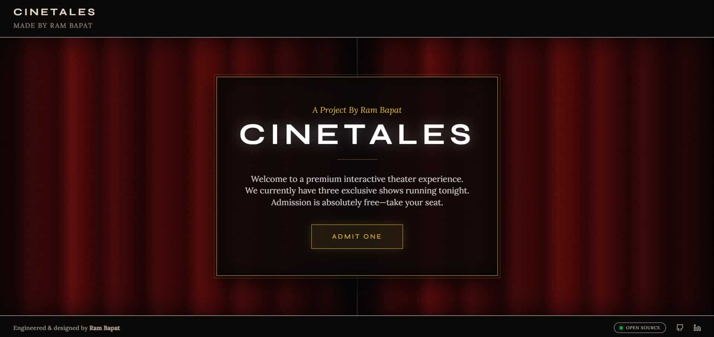
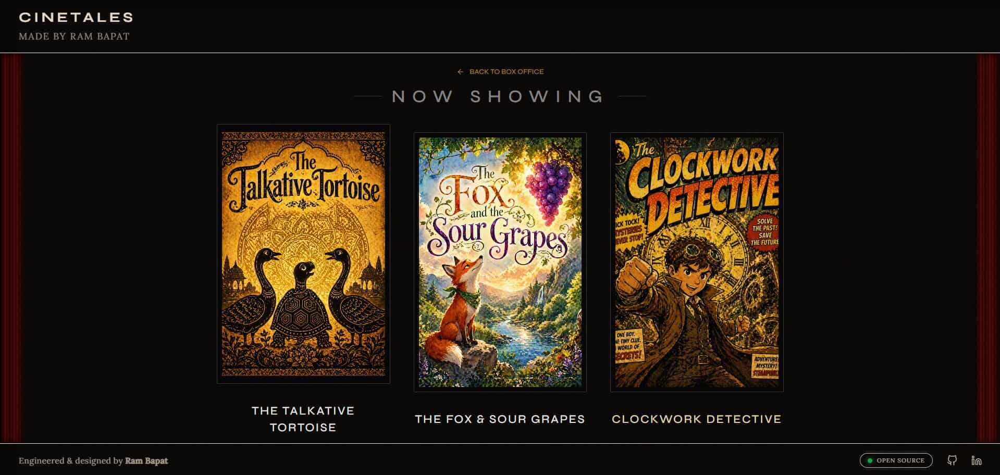
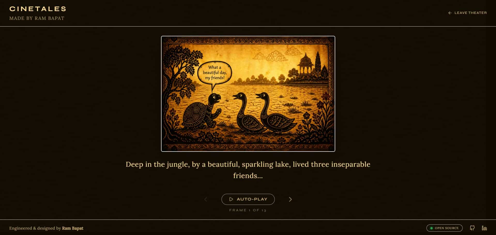
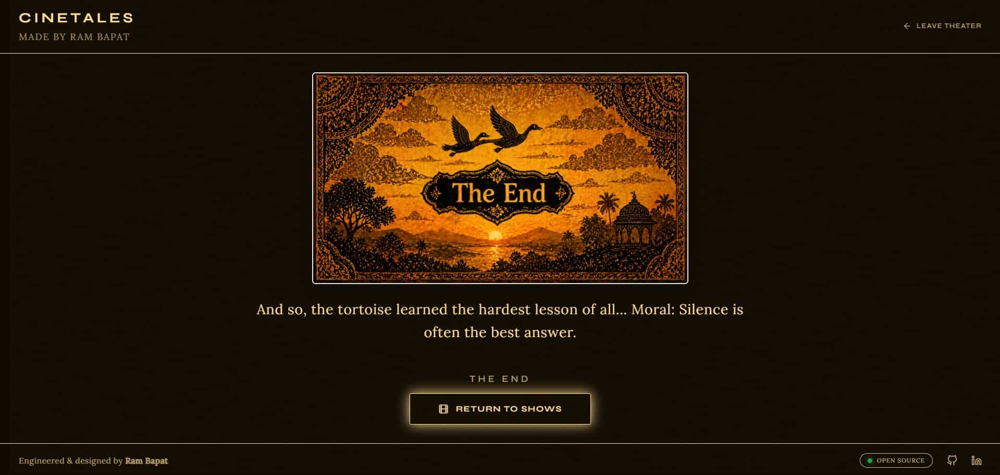
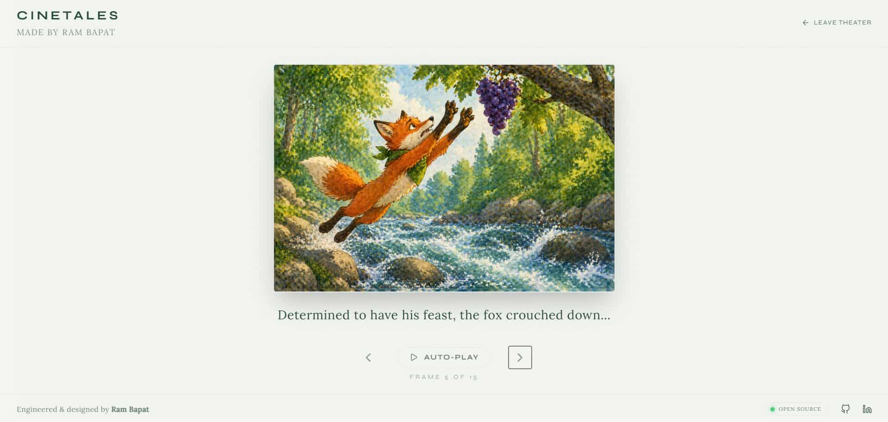
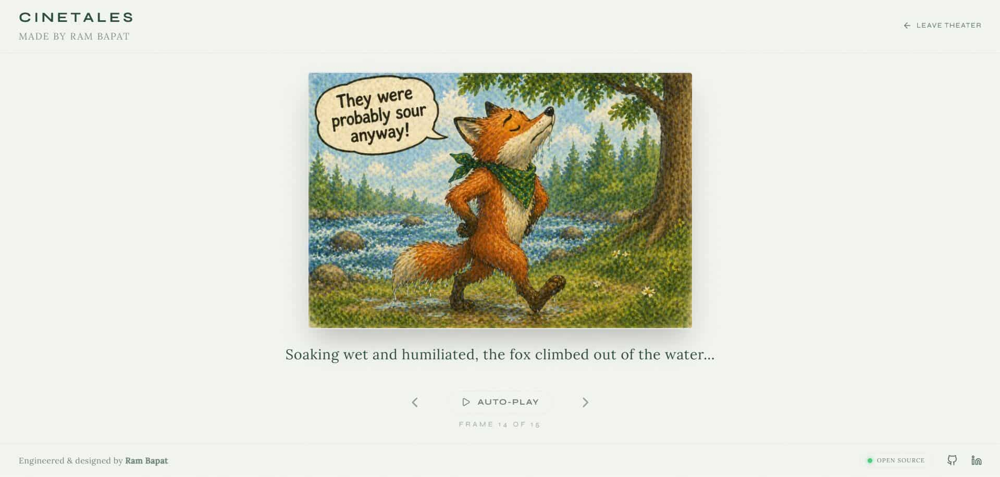
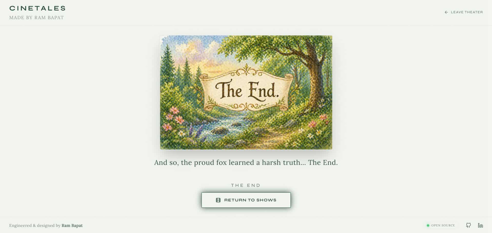
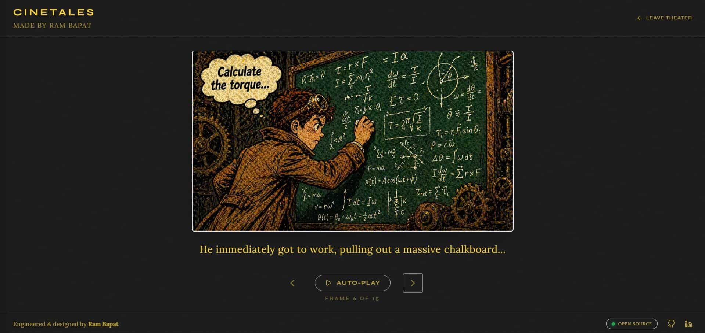
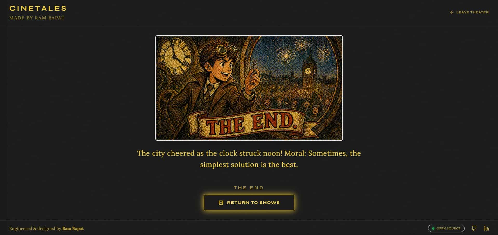

# 🎬 CineTales

    

**Day 29 / 30 - April Vibe Coding Challenge**

## 🔗 [Live Demo](https://cinetales-interactive-theater.vercel.app/)

**CineTales** is an ultra-premium, interactive cinematic visual storyboard experience. Step into the digital box office, watch the velvet curtains sweep open, and immerse yourself in three distinct, beautifully illustrated short stories. The entire application dynamically morphs its aesthetic to match the movie you are watching.

## 📸 Screenshots











## ✨ Features

*   **🎭 Epic Theatrical UI/UX:** Features a fully animated "Box Office" lobby with CSS-textured heavy velvet curtains that dynamically slide open using Framer Motion orchestration. 
*   **🎨 Dynamic Theme Morphing:** The moment a movie is selected, the global application state shifts. The background, text, borders, and UI accents seamlessly melt into the specific color palette of the chosen film over a 1-second transition.
*   **🤖 AI-Generated Distinct Art Styles:** Showcasing three unique stories crafted with consistent AI generation:
    *   *The Talkative Tortoise:* Indian Shadow Puppetry on glowing parchment.
    *   *The Fox & The Sour Grapes:* Soft, lush Watercolor Children's Book style.
    *   *The Clockwork Detective:* Gritty, vintage 1960s Halftone Comic Book art.
*   **📱 Flawless Responsive Design:** Built with strict `100dvh` bounds to feel like a native app. Mobile users get a premium snap-scrolling poster carousel and perfectly fitted image-to-text aspect ratios without any vertical overflow.
*   **⏱️ Smart Auto-Play Engine:** Includes an adjustable cinematic auto-play slider (2s to 8s), allowing users to sit back and let the story unfold autonomously.

## 🛠️ Tech Stack

*   **Frontend Framework:** React 19 + TypeScript
*   **Build Tool:** Vite
*   **Styling:** Tailwind CSS 4 (Custom Cinematic Theming)
*   **Animations:** Framer Motion (`motion/react`)
*   **Icons:** Custom SVG Vectors & Lucide React
*   **Typography:** `Syne` (Display) + `Lora` (Storytelling)

## 🚀 Getting Started

### 1. Clone the Repository
```bash
git clone https://github.com/Barrsum/Cinetales-Interactive-Theater.git
cd Cinetales-Interactive-Theater
```

### 2. Install Dependencies
```bash
npm install
```

### 3. Run the App
```bash
npm run dev
```

## 👤 Author

**Ram Bapat**
*[LinkedIn](https://www.linkedin.com/in/ram-bapat-barrsum-diamos)
*[GitHub](https://github.com/Barrsum)

---
*Part of the April 2026 Vibe Coding Challenge.*